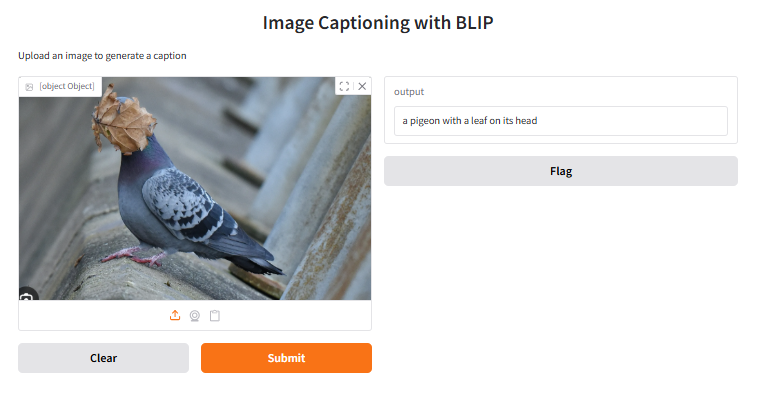

# Image Captioning with BLIP



This project uses Salesforce's [BLIP (Bootstrapping Language-Image Pre-training)](https://huggingface.co/Salesforce/blip-image-captioning-base) model to automatically generate text descriptions for uploaded images. The interface is built using the Gradio library.

## Features
- Generate natural language captions for any image.
- Simple web interface (drag and drop files or browse).
- Optimized generation parameters to avoid repetitions (`repetition_penalty`, `no_repeat_ngram_size`).
- Automatic conversion of images to RGB format (support for PNG with transparency).

## Installation

1. Clone the repository:
```bash
git clone https://github.com/MNJMARIA/blip-image-captioning.git
cd blip-image-captioning